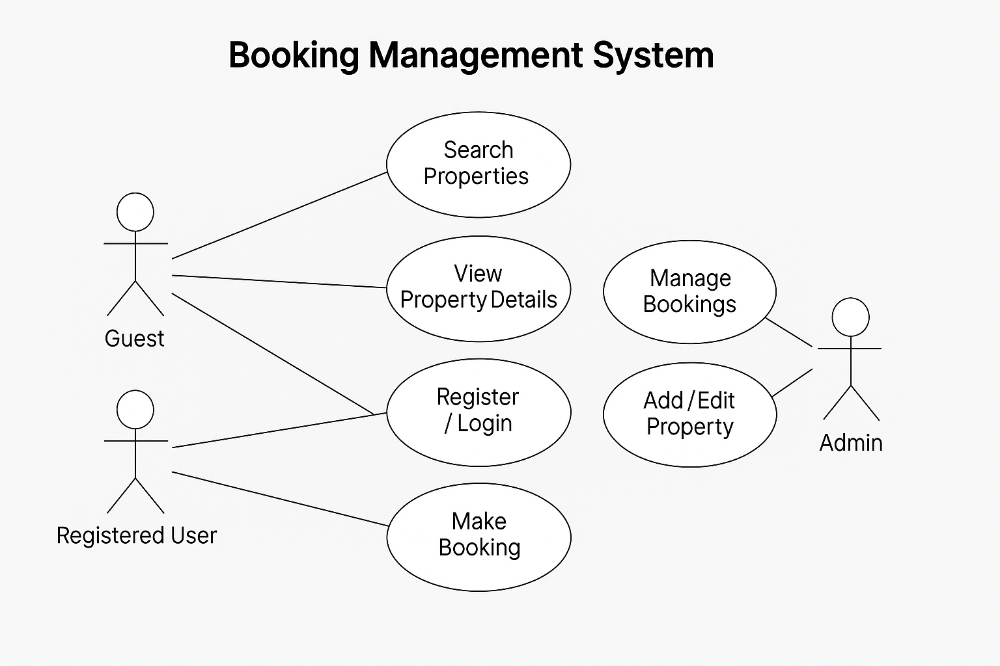

# Requirement Analysis in Software Development

## Introduction
This repository has been created as part of the ALX ProDev Frontend program.  
It focuses on documenting the Requirement Analysis phase of the Software Development Lifecycle (SDLC).

The purpose of this repository is to:
- Demonstrate understanding of how requirements are gathered, analyzed, and documented.
- Provide a structured reference for both functional and non-functional requirements.
- Illustrate how to use tools like Draw.io for visual modeling (Use Case Diagrams).
- Define clear Acceptance Criteria for better project validation and delivery.

By completing this repository, we aim to build a strong foundation for the next development phases such as design, implementation, and testing.

## What is Requirement Analysis
Requirement Analysis is a crucial phase in the Software Development Lifecycle (SDLC) where the needs and expectations of stakeholders are gathered, analyzed, and documented in detail before development begins.

The main goal of this process is to ensure that everyone involved in the project, from developers to clients, has a clear and shared understanding of what the system should do and how it should perform.

Key aspects of Requirement Analysis:
- Understanding Needs: Identifies what users need from the system and what problems the software must solve.  
- Defining Scope: Establishes the boundaries of the project and prevents unnecessary features (scope creep).  
- Laying the Foundation: Serves as the blueprint for design, development, and testing.  
- Ensuring Quality: Clear and validated requirements help deliver a product that meets expectations and satisfies users.  

In short, Requirement Analysis bridges the gap between the client’s vision and the developer’s implementation by transforming ideas into actionable, testable, and measurable requirements.

## Why is Requirement Analysis Important
Requirement Analysis plays a vital role in the Software Development Lifecycle (SDLC) because it lays the foundation for every other phase, from design to deployment.  
Without clear and validated requirements, projects risk delays, scope changes, and costly rework.

Here are the key reasons why Requirement Analysis is essential:

1. Clarity and Understanding  
   It helps all stakeholders, including developers, clients, and end-users, share a common understanding of what the software should accomplish.  
   This minimizes confusion and aligns everyone’s expectations.

2. Scope Definition  
   By clearly defining what is and is not included in the project, Requirement Analysis helps prevent scope creep, which is the uncontrolled expansion of features or objectives during development.

3. Basis for Design and Development  
   Requirements act as the blueprint for system design and implementation.  
   Accurate requirements ensure that developers build the right product in the right way.

4. Cost and Time Estimation  
   Well-defined requirements allow teams to estimate budgets, timelines, and resources more accurately, leading to efficient planning and delivery.

5. Quality Assurance  
   When requirements are clear and testable, quality teams can create precise test cases to verify that the system meets all expectations, resulting in a high-quality product.

In summary, Requirement Analysis ensures that every line of code serves a clear purpose, every feature adds value, and every stakeholder knows what success looks like.

## Key Activities in Requirement Analysis
Requirement Analysis involves a set of structured activities that ensure the software meets the expectations of all stakeholders.  
Each activity contributes to understanding, documenting, and validating the project requirements before development begins.

1. Requirement Gathering  
   This step focuses on collecting information from all stakeholders to understand their needs and expectations.  
   Techniques include interviews, surveys, observation, workshops, and document analysis.

2. Requirement Elicitation  
   In this phase, the gathered requirements are refined and clarified.  
   Techniques such as brainstorming, focus groups, and prototyping help in defining precise and actionable requirements.

3. Requirement Documentation  
   The documented requirements serve as the foundation for design and development.  
   Common documentation methods include requirement specification documents, user stories, and use case diagrams.

4. Requirement Analysis and Modeling  
   This step involves analyzing the collected requirements to identify dependencies, priorities, and feasibility.  
   Modeling tools like data flow diagrams (DFDs) or entity-relationship diagrams (ERDs) are used to visualize and better understand the system.

5. Requirement Validation  
   The final step ensures that all requirements are accurate, complete, and aligned with business goals.  
   Validation includes stakeholder reviews, defining acceptance criteria, and maintaining traceability between requirements and project deliverables.

Together, these activities provide a clear roadmap for building a system that satisfies both user and business needs.

## Types of Requirements
Requirements in software development are generally divided into two main categories: Functional and Non-functional.  
Understanding both types ensures that the system not only performs the intended tasks but also does so efficiently, securely, and reliably.

### Functional Requirements
Functional requirements describe what the system should do — the specific behaviors, actions, and functions that define how the system operates.  
They represent the features that directly fulfill user needs and business objectives.

Examples of functional requirements for a booking management system:
- Search Properties: Users should be able to search for properties based on filters like location, price, and availability.  
- User Registration: New users should be able to create accounts, log in, and manage their profiles.  
- Property Listings: The system should display available properties with images, descriptions, and pricing.  
- Booking System: Users should be able to book properties, confirm reservations, and view booking history.  
- User Authentication: The system must verify user credentials and protect sensitive information.

### Non-functional Requirements
Non-functional requirements define how the system should perform rather than what it should do.  
They focus on quality attributes such as performance, security, usability, and scalability.

Examples of non-functional requirements for a booking management system:
- Performance: Pages should load within 2 seconds and handle up to 1,000 concurrent users.  
- Security: Data must be encrypted, user sessions secured, and the system protected from vulnerabilities.  
- Scalability: The application should be able to scale horizontally to handle increasing traffic.  
- Usability: The interface must be intuitive and user-friendly for both new and returning users.  
- Reliability: The system should have 99.9% uptime and recover quickly from failures.

By clearly distinguishing between functional and non-functional requirements, teams can ensure that both user expectations and technical standards are met throughout development.

## Use Case Diagrams
A Use Case Diagram is a visual representation that illustrates how different users (called actors) interact with the system to achieve specific goals.  
It helps communicate system functionality at a high level and ensures all stakeholders share the same understanding of the system’s scope.

### Purpose of Use Case Diagrams
- To visualize the interactions between users and the system.  
- To identify the system’s main functionalities.  
- To help in requirement validation and understanding user expectations.  
- To serve as a foundation for writing detailed use cases and functional requirements.

### Key Elements
- Actors: Represent the users or external systems that interact with the software.  
- Use Cases: Represent the actions or goals that the actors want to achieve.  
- System Boundary: Defines the limits of the system and what’s included in its functionality.  
- Relationships: Indicate how actors and use cases are connected.

### Example for a Booking Management System
Actors:
- Guest (unregistered user)
- Registered User
- Admin

Use Cases:
- Search Properties  
- View Property Details  
- Register / Login  
- Make a Booking  
- Manage Bookings  
- Add or Edit Property (Admin only)  
- Manage Users (Admin only)

### How to Create the Diagram
1. Open Draw.io or any similar tool.
2. 

3. Create a system boundary labeled “Booking Management System.”  
4. Add the actors (Guest, Registered User, Admin) outside the boundary.  
5. Inside the boundary, list the main use cases mentioned above.  
6. Connect each actor to the corresponding use cases using association lines.

